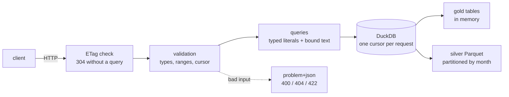
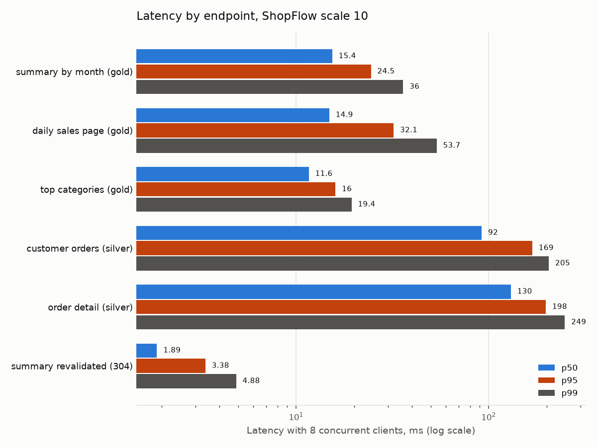
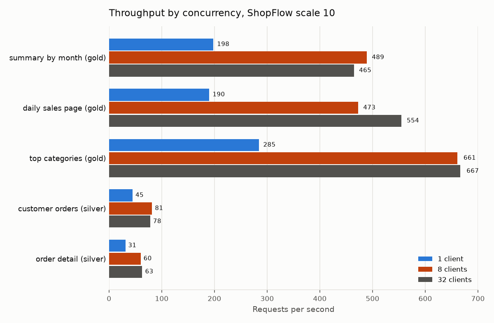

<p align="center">
  
</p>

<p align="center">
  <a href="https://github.com/silvano-moraes-de-souza/sales-analytics-api/actions/workflows/ci.yml"></a>
  
  
  
  
  <a href="https://github.com/silvano-moraes-de-souza/30-days-data-eng"></a>
</p>

> A read-only REST API over the lakehouse of day 04: daily sales, summaries, top categories and order lookups, served by FastAPI and DuckDB straight from Parquet. Typed responses, keyset pagination, errors as problem details, conditional requests, and latency measured under load.

<table>
<tr>
<td align="center"><b>0 cents off</b><br/>API revenue vs the source,<br/>checked on every test run</td>
<td align="center"><b>24x</b><br/>summary from gold 3.7 ms vs<br/>from 1M silver orders 86 ms</td>
<td align="center"><b>3,763 req/s</b><br/>ETag revalidation (304),<br/>p50 1.9 ms</td>
<td align="center"><b>1.7 ms</b><br/>cost of one bound parameter<br/>in DuckDB's Python client</td>
</tr>
</table>

<sub>All numbers come from <a href="bench/run.py">bench/run.py</a> and <a href="results/">results/</a>.</sub>

**Contents:** [Problem](#problem) · [Endpoints](#endpoints) · [Quickstart](#quickstart) · [Results](#results) · [How it works](#how-it-works) · [Engineering decisions](#engineering-decisions) · [Tests](#tests) · [Limitations](#limitations)

## Problem

A gold layer nobody can query is a folder of files. Dashboards, other services and people need it behind a stable contract: known fields and types, predictable errors, pages that do not slow down as the data grows, and answers that match the source.

This API puts that contract in front of the [mini-lakehouse](https://github.com/silvano-moraes-de-souza/mini-lakehouse) built on day 04, without copying the data into a database first.

## Endpoints

| Method and path | Returns | Reads |
|---|---|---|
| `GET /v1/sales/daily?start&end&channel&limit&cursor` | orders and revenue per day and channel, paged | gold |
| `GET /v1/sales/summary?start&end&group_by=channel\|month` | totals for a period | gold |
| `GET /v1/categories/top?month&limit` | categories ranked by revenue | gold |
| `GET /v1/customers/{id}/orders?limit&cursor` | one customer's orders, newest first, paged | silver |
| `GET /v1/orders/{id}` | one order with its line items | silver |
| `GET /health` | status, data version, row counts | gold |

Money is integer cents. Timestamps are UTC. Business days are UTC-3. Interactive docs at `/docs`, the contract at `/openapi.json`.



## Quickstart

```bash
git clone https://github.com/silvano-moraes-de-souza/sales-analytics-api
cd sales-analytics-api
docker compose up --build     # builds a small lakehouse, serves on localhost:8000
curl "localhost:8000/v1/sales/summary?start=2025-01-01&end=2025-12-31&group_by=month"
```

Without Docker:

```bash
uv sync
uv run pytest                                  # 20 tests
uv run sales-api seed --scale 0.1 --lake lake  # lakehouse from the day-04 pipeline
uv run sales-api serve --lake lake             # http://127.0.0.1:8000/docs
uv run python -m bench.run                     # rebuilds results/ and the charts
```

## Results

Measured on a laptop (Intel 11th gen Tiger Lake, 6 cores, 24 GB RAM, Windows 11) with a ShopFlow scale 10 lakehouse: 1,000,000 orders over 731 days, 2,193 rows in `daily_sales`. The API runs in one uvicorn process; the load generator runs on the same machine with one thread and one keep-alive connection per client, 8 seconds per case. Every JSON in [`results/`](results/) records the machine and the commit.

### Latency and throughput over HTTP

| Endpoint | 1 client: p50 / p95 | 8 clients: p50 / p95 / p99 | Requests per second (1 / 8 / 32 clients) |
|---|---:|---:|---:|
| Summary by month (gold) | 4.6 / 7.2 ms | 15.4 / 24.5 / 36.0 ms | 198 / 489 / 465 |
| Daily sales page (gold) | 4.2 / 7.6 ms | 14.9 / 32.1 / 53.7 ms | 190 / 473 / 554 |
| Top categories (gold) | 3.0 / 6.4 ms | 11.6 / 16.0 / 19.4 ms | 285 / 661 / 667 |
| Customer orders (silver) | 20.3 / 26.1 ms | 92.1 / 169 / 205 ms | 45 / 81 / 78 |
| Order detail (silver) | 30.2 / 40.1 ms | 130 / 198 / 249 ms | 31 / 60 / 63 |
| Summary revalidated with ETag (304) | | 1.9 / 3.4 / 4.9 ms | 3,763 at 8 clients |





Two things stand out. Throughput stops growing after 8 clients: one Python process is the ceiling, and more clients only queue. And the silver endpoints are 4 to 10 times slower than the gold ones with one client, because finding one customer or one order in Parquet means scanning: there is no index. Those two endpoints are what day 07 puts a cache in front of.

### What the gold layer saves

The monthly summary of 2025, same answer both ways (asserted), in-process.

| Source | Rows read | Median |
|---|---:|---:|
| Gold `daily_sales`, loaded in memory | 2,193 | 3.7 ms |
| Silver orders, aggregated on every call | 1,000,000 | 86.4 ms |

### What a bound parameter costs

In-process, median of 300 runs.

| Query | Median |
|---|---:|
| `SELECT 1` | 0.19 ms |
| `SELECT ?` with one bound parameter | 1.88 ms |
| Summary with typed literals | 2.35 ms |
| Summary with two bound parameters | 5.67 ms |

A bound parameter adds about 1.7 ms in DuckDB's Python client, more than the query itself on a small table. Preparing a statement once and executing it with parameters is not available from Python (`EXECUTE` cannot take bound values). So dates and integers are rendered as typed literals and only free text is bound.

### The load generator mattered

The first version of the benchmark drove the API with `httpx.AsyncClient` from the benchmark process. It reported a fraction of the throughput shown here, and a 304 that runs no query came out slower than a real query, which made no sense. Calling the server with a plain `http.client` connection showed the client was the bottleneck. The numbers above use one thread and one raw connection per client; that earlier run was discarded.

## How it works

### One connection, one cursor per request

[`store.py`](src/sales_analytics_api/store.py) opens DuckDB once. The two gold tables are small and are loaded into memory at startup; silver stays on disk as Parquet behind views. Each request takes its own cursor from the shared connection, which is how DuckDB is meant to be used from several threads.

Settings do not carry over to cursors. The time zone was first set on the main connection only, so requests fell back to the machine's time zone and one order near midnight moved to another day. A test that compares the gold summary with the same summary computed from silver caught it. The setting is now `SET GLOBAL`.

### Keyset pagination with opaque cursors

A page returns `next_cursor`, the sort key of its last row encoded in base64. The next request resumes right after that key, so page 500 costs the same as page 1. A test walks every page of a listing and checks that the rows are exactly the unpaged result: nothing repeated, nothing skipped.

### Values in SQL

Free text from a request (a channel name) is always a bound parameter. Integers, dates and timestamps are rendered as typed literals by a small function that refuses anything that is not already an `int`, `date` or `datetime`. Values inside a client-supplied cursor are parsed into those types first; if that fails the answer is 400. No request text is concatenated into SQL, and the tests send hostile filters and cursors to prove it.

The reason is in the results: binding a parameter costs more than the query.

### Errors and conditional requests

Every error is `application/problem+json` (RFC 9457) with `title`, `status` and, for validation errors, the offending fields. Data only changes when the gold layer is rebuilt, so each `GET /v1/...` carries an ETag derived from the data version and the URL. A client that sends it back gets `304 Not Modified` before any query runs.

## Engineering decisions

| Decision | Alternative | Why |
|---|---|---|
| DuckDB reading Parquet in place | Load the gold layer into PostgreSQL | No second copy to keep in sync; the lakehouse stays the single source. The cost is slow point lookups on silver, measured above. |
| Gold in memory, silver on disk | Everything as Parquet views | Gold is 2,193 rows; memory makes those endpoints a few milliseconds. Silver is a million rows and stays on disk. |
| Typed literals for ints and dates, bound parameters for text | Bind everything | 2.4x faster summary (2.35 vs 5.67 ms). Safe because only values already parsed into `int`, `date` or `datetime` are rendered, and tests attack it. |
| Keyset cursors, opaque to the client | `page` and `OFFSET` | Constant cost per page (day 05 measured OFFSET at 5,141x slower halfway through a million rows), and the client cannot depend on the cursor format. |
| `SET GLOBAL TimeZone = 'UTC'` | Session setting | Cursors do not inherit session settings; a wrong time zone silently moves orders across day boundaries. |
| Integer cents everywhere | Floats or decimals as JSON numbers | No rounding. The gold layer of day 04 was fixed to store BIGINT instead of double when this project found it. |
| ETag from data version + URL | No caching headers | The data changes only when gold is rebuilt, so revalidation is safe and costs 1.9 ms instead of a query. |
| `application/problem+json` for every error | FastAPI's default error bodies | One error shape for clients to handle, with field-level detail on validation errors. |


## Tests

20 tests on Python 3.11, 3.12 and 3.13 in CI, plus a Docker Compose job that starts the container and calls the API.

| What | Checked by |
|---|---|
| Revenue matches the ShopFlow source to the cent | summary total vs a query on the source files |
| Gold and silver give the same summary | field by field equality (this caught the time zone bug) |
| Pagination covers every row exactly once, in order | walking all pages of two listings |
| Order detail adds up | line items sum to the subtotal; subtotal, discount and shipping give the total |
| Errors | nine bad requests, each answered with the right status as problem+json |
| Injection | a quoted `OR '1'='1'` filter returns nothing; hostile cursors get 400 or are treated as plain values; data unchanged afterwards |
| Conditional requests | same URL with `If-None-Match` gives 304 with an empty body |
| Contract | `/openapi.json` lists exactly the six routes and the `Problem` schema |

## Limitations

- One process. Throughput tops out near 500 to 670 requests per second on the gold endpoints; more uvicorn workers would scale it, each with its own copy of gold in memory. Not measured.
- Point lookups on silver scan Parquet (20 to 30 ms each, 60 to 80 requests per second). A cache (day 07) or an indexed store is needed for those.
- No authentication or rate limiting; the gateway on day 18 adds them.
- The data version is read at startup. Rebuilding the gold layer requires restarting the API.
- Load generator and server share one machine, so they compete for CPU. Latency is measured at the client.
- The ETag is weak and per URL; there is no `Vary` handling because responses do not depend on headers.


## Project structure

```
src/sales_analytics_api/
  app.py          routes, validation, problem+json errors, ETag middleware
  queries.py      SQL per endpoint, typed literals and bound text
  store.py        DuckDB connection, gold in memory, silver views, data version
  models.py       response contract (Pydantic)
  pagination.py   opaque keyset cursors
  seed.py         builds a lakehouse with the day-04 pipeline
  cli.py          sales-api seed | serve
bench/            load generator, benchmarks and charts
results/          benchmark output (JSON, with machine and commit)
tests/
```

## Part of the series

Day 06 of [30 Days of Data & Software Engineering](https://github.com/silvano-moraes-de-souza/30-days-data-eng). It serves the gold and silver layers of [mini-lakehouse](https://github.com/silvano-moraes-de-souza/mini-lakehouse) (day 04). Day 07 puts a cache in front of the slow endpoints measured here.

## Author

**Silvano Moraes de Souza** · [LinkedIn](https://www.linkedin.com/in/silvano-moraes-de-souza) · [Portfolio](https://silvanomsouza.vercel.app/)
